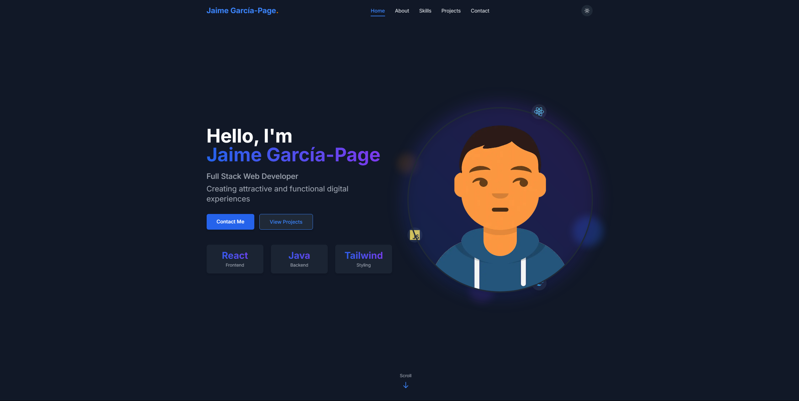

<div align="center">

# Portfolio - Jaime García-Page

[](https://jaimegpm.github.io/Portfolio/)

</div>

A modern and responsive personal portfolio showcasing my skills, projects, and experience as a web developer. Designed with a focus on user experience, smooth animations, and modern aesthetics.



## 🚀 Technologies Used

<div align="center">
  


</div>

## ⚡ Features

- Responsive design for all devices
- Automatic and manual dark/light mode
- Smooth animations and visual effects
- Custom cursor and interactive elements
- Functional contact form with EmailJS
- Optimized for performance and SEO

## 🔧 Quick Installation

1. **Clone the repository**
   ```bash
   git clone https://github.com/jaimegpm/Portfolio.git
   cd Portfolio
   ```

2. **Install dependencies**
   ```bash
   npm install
   ```

3. **Configure EmailJS** (optional for contact form)
   - Create `src/config/emailjs.js` file with your credentials

4. **Start development server**
   ```bash
   npm run dev
   ```

## 📦 Deployment

```bash
npm run deploy
```
---
<div align="center">
  
[](https://github.com/jaimegpm)
[](https://www.linkedin.com/in/jaime-garc%C3%ADa-page-marchante-a9a9a9246/)

</div>
